# 📖 Holy Quran & Islamic Suite App

[](https://flutter.dev)
[](https://dart.dev)
[-FF6F00?style=for-the-badge&logo=google&logoColor=white)](https://pub.dev/packages/provider)
[](https://flutter.dev)

A feature-rich, optimized, and beautifully crafted Islamic application built with Flutter. This application provides users with an offline-first Holy Quran experience featuring multi-language translations, a comprehensive digital Tasbih counter with audio-haptic feedback, smart prayer tracking based on live calculations, and customized UI state configurations.

---

## 📱 App Walkthrough & Screenshots

Explore the pixel-perfect, premium user interface designed with deep Islamic emerald accents (`#2E7D32` & `#1B3D2A`) supporting responsive light and dark themes:

### 🌟 Core Dashboards & Splashes
<p align="center">
  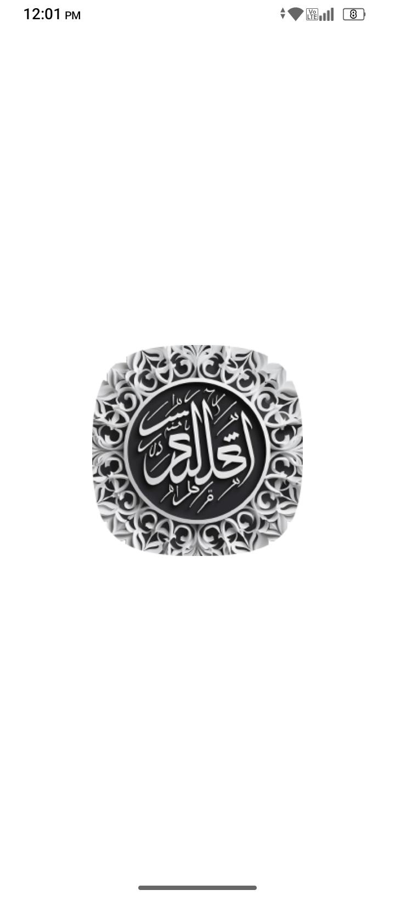
  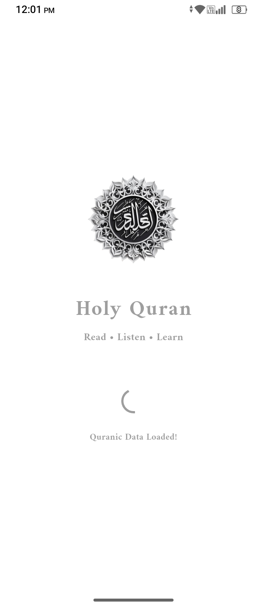
  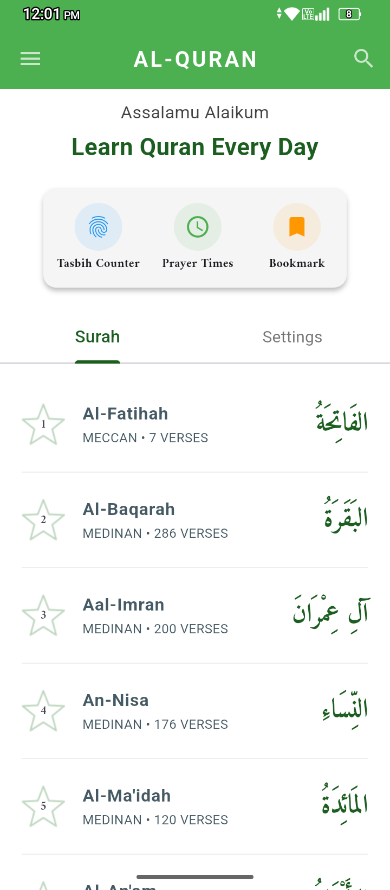
  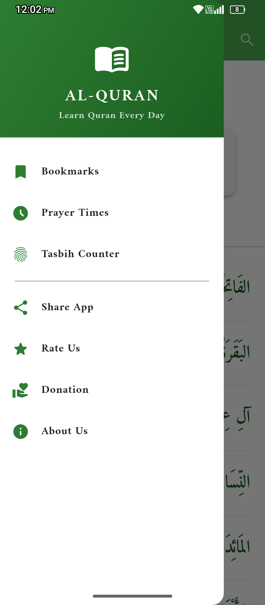
</p>

### 📖 Holy Quran & Customization Experience
<p align="center">
  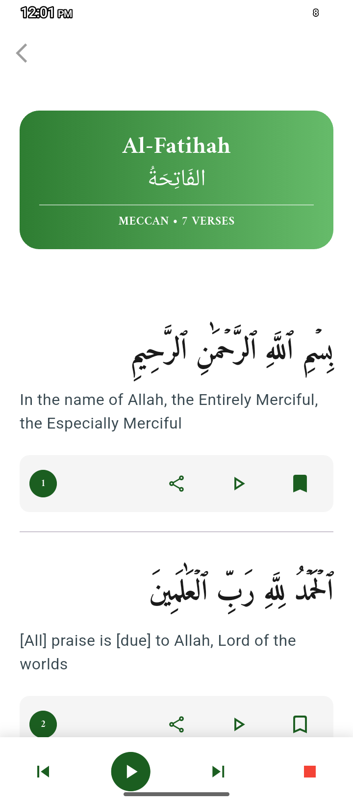
  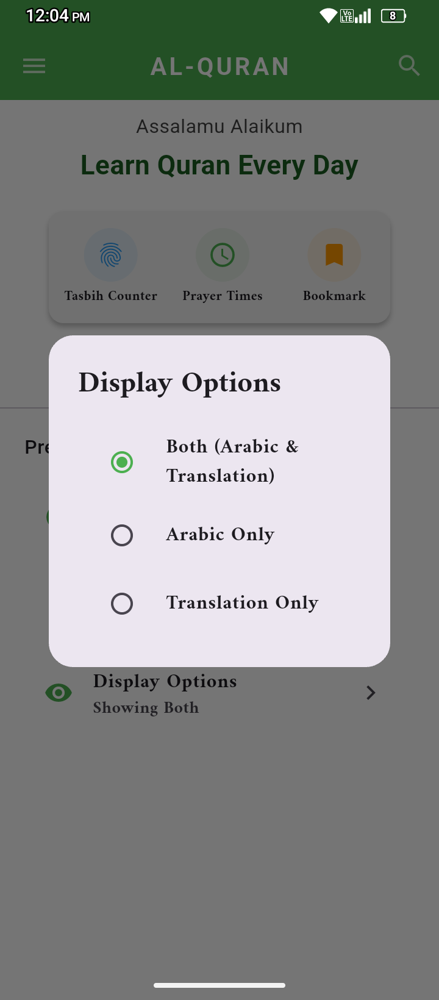
  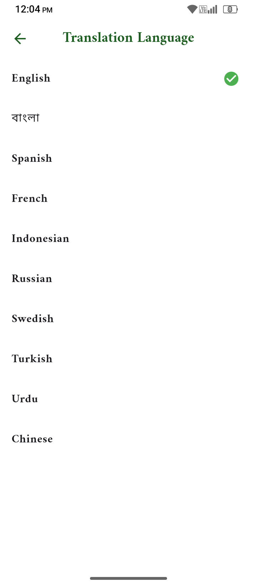
  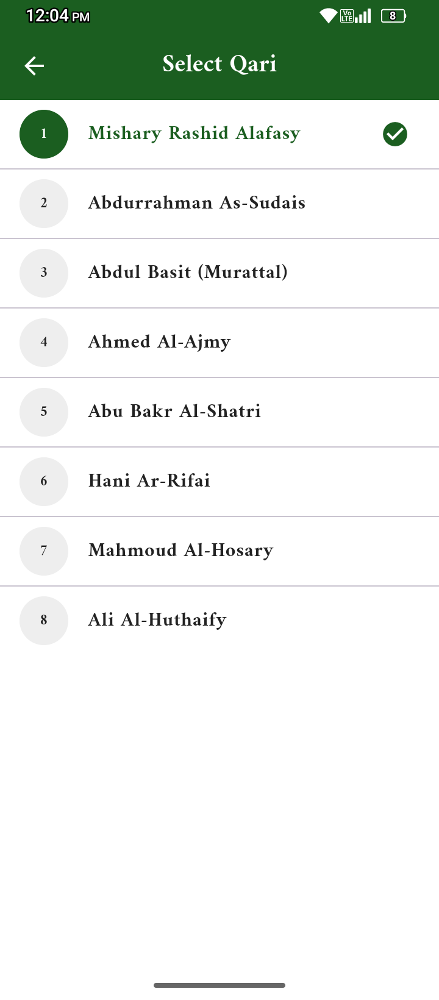
</p>

### 📿 Smart Tasbih & Prayer Modules
<p align="center">
  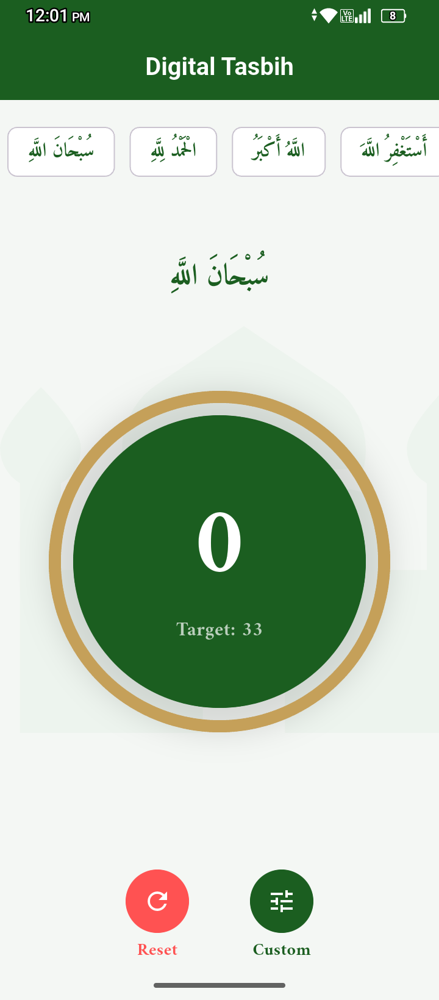
  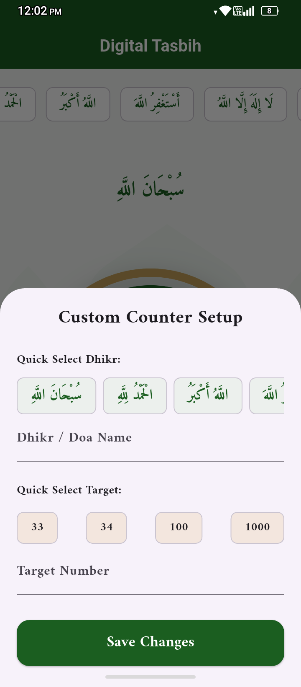
  
  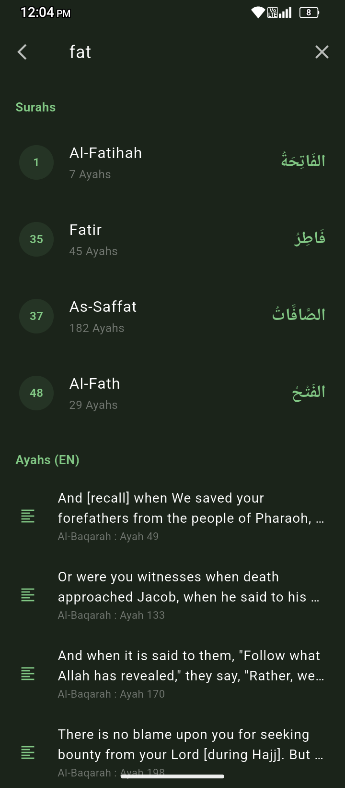
</p>

### 🔖 Bookmarks, Sadaqah & Settings
<p align="center">
  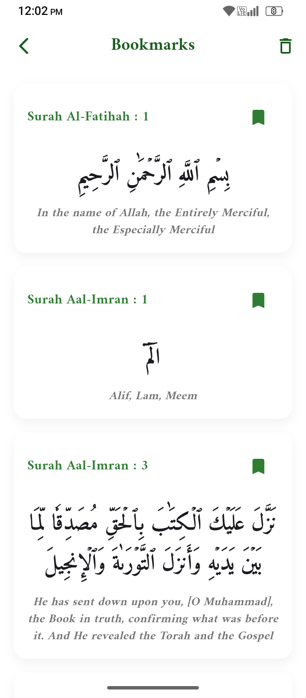
  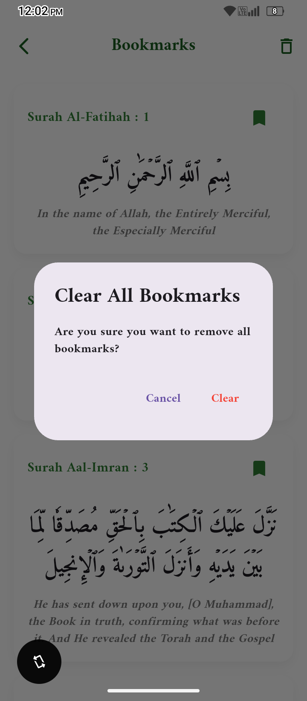
  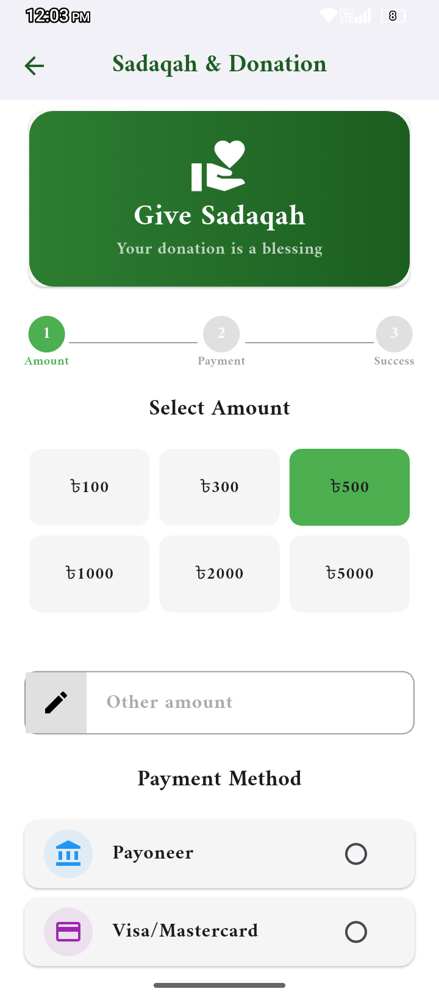
  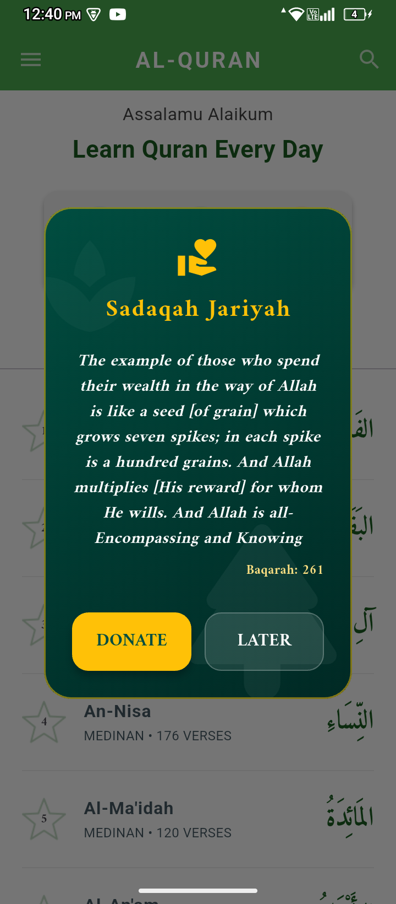
</p>

### ⚙️ System Configuration & Info
<p align="center">
  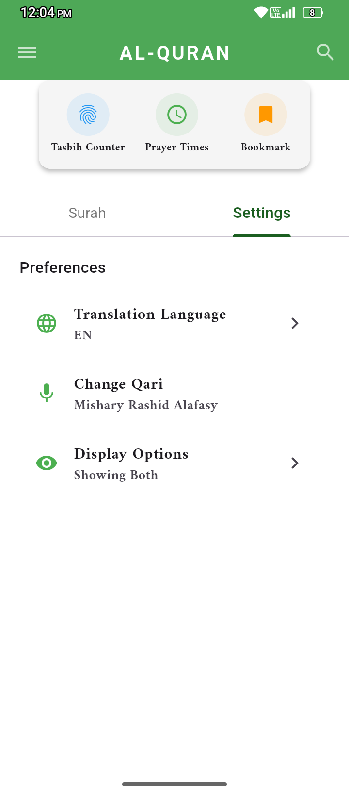
  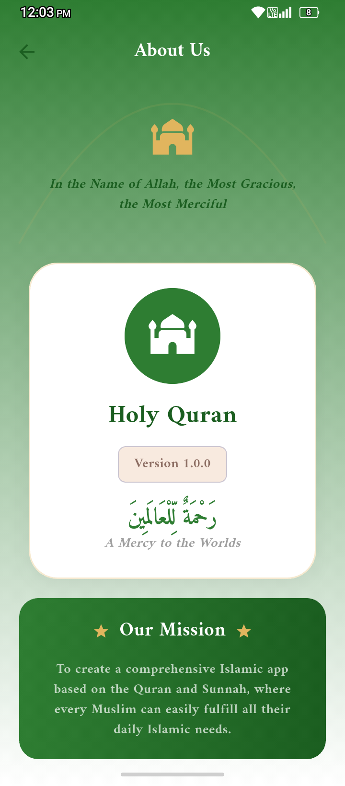
  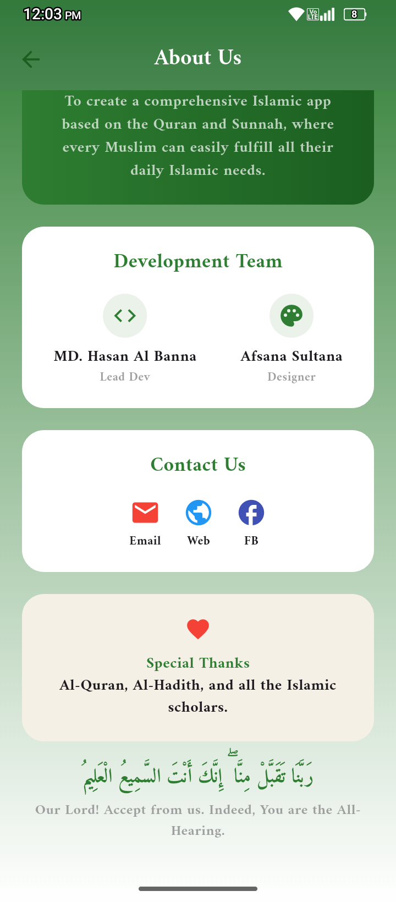
</p>

---

## ✨ Key Features

*   **📖 Al-Quran Al-Kareem:** High-performance typography rendering engine (`QuranFont`) with optimized caching for flawless reading.
*   **🌍 Multi-lingual Localized Engine:** Seamlessly toggle localized data arrays among 10 languages (English, Bengali, Spanish, French, Indonesian, Russian, Swedish, Turkish, Urdu, Chinese).
*   **📿 Audio-Haptic Tasbih Module:** Complete Dhikr suite integrated with asynchronous `just_audio` system triggers and hardware impact configurations (`HapticFeedback`).
*   **📍 Location-Aware Prayer Timings:** Precision offline algorithm using `adhan` and `geolocator` mapping with manual adjustments and smart fallback systems.
*   **🔖 Smart Bookmarks & Caching:** Granular persistence for individual Ayahs utilizing asynchronous `SharedPreferences` encoding.
*   **💳 Dynamic Donation UI Integration:** Built-in monetization layer support with native dialog components for global integration.

---

## 🏗️ Technical Architecture & Complete Project Directory

This workspace incorporates the Clean Architectural MVVM (Model-View-ViewModel) pattern via state management blocks, eliminating boilerplate code dependencies:

```text
lib/
├── main.dart                       # App core engine launcher & global MultiProvider tree
├── data/                           # Local hardcoded structural asset datasets
│   └── qari_data.dart              # Static collection records for supported Reciters
├── font/                           # Custom typography assets configuration
│   └── fonts_style.dart            # Typography wrapper for Arabic layout dimensions
├── logics/                         # Business logic & cross-cutting utilities
│   ├── prayer_logic.dart           # Offline Adhan calculations & dynamic geo-coordinate fetchers
│   ├── quran_search.dart           # Custom inline multi-dimensional text query search algorithm
│   └── share_logic.dart            # Platform share triggers to broadcast multilingual Ayahs
├── providers/                      # Application state managers (ViewModels)
│   ├── bookmark_provider.dart      # Manages reactive local data caching operations for Ayahs
│   ├── notification_provider.dart  # Controls operational status and updates for notifications
│   ├── qari_provider.dart          # Keeps track of selected globally streamable reciters
│   ├── quran_provider.dart         # Synchronizes real-time multi-lingual translation bindings
│   ├── tasbih_provider.dart        # Real-time counter tracker mapping sound and vibration states
│   └── view_mode_provider.dart     # Persists layout structure models (Arabic, Translation, or Both)
├── screens/                        # UI Presentation Layout Viewports
│   ├── bookmark_screen.dart        # Lists out bookmarked records safely
│   ├── donation_screen.dart        # Beautiful interactive dashboard for donations
│   ├── home_screen.dart            # Main structural dashboard of the application
│   ├── language_ui.dart            # Language selector interface layout
│   ├── main_drawer.dart            # App wide navigation slide drawer control
│   ├── prayer_screen.dart          # Renders automated high-fidelity localized prayer time wheels
│   ├── qari_selection_screen.dart  # Stream list control hub for selectable reciters
│   ├── splash_screen.dart          # Handles asynchronous application initialization workflows
│   ├── surah_detail_screen.dart    # Immersive scroll viewport tailored for core Quran reading
│   └── tasbih_screen.dart          # Full screen interactive digital counter workspace
├── services/                       # Third-party transaction pipelines
│   └── payment_service.dart        # Setup logic wrapper for localized monetization pipelines
├── themes/                         # Look and feel parameters configuration
│   └── theme_provider.dart         # Direct cross-platform state switcher for light & dark mode
└── widgets/                        # Atomic decoupled building blocks
    ├── about_us.dart               # Dedicated modal rendering organizational info
    ├── guidance_overlay_card.dart  # Contextual smart tutorial modal helper layer
    ├── quick_action_card.dart      # Grid component tailored for lightning-fast module hops
    └── show_sadakah_overlay.dart   # Interactive operational notification sheet for donations

